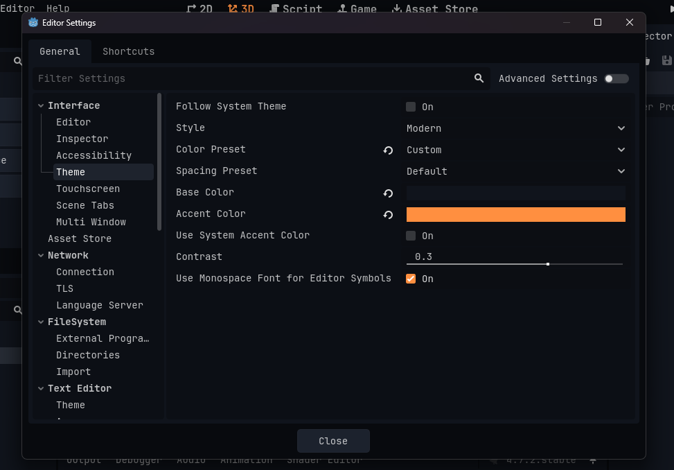

# HArk's Godot Theme :)

### Base Color - `#10141C`
### Accent Color - `#FF8F40`

### Main Font - `JetBrainsMonoNL - Regular`
### Main Font Bold - `JetBrainsMonoNL - Bold`
### Code Font - `JetBrainsMonoNL - Regular`

## 

## Ayu Theme :)
